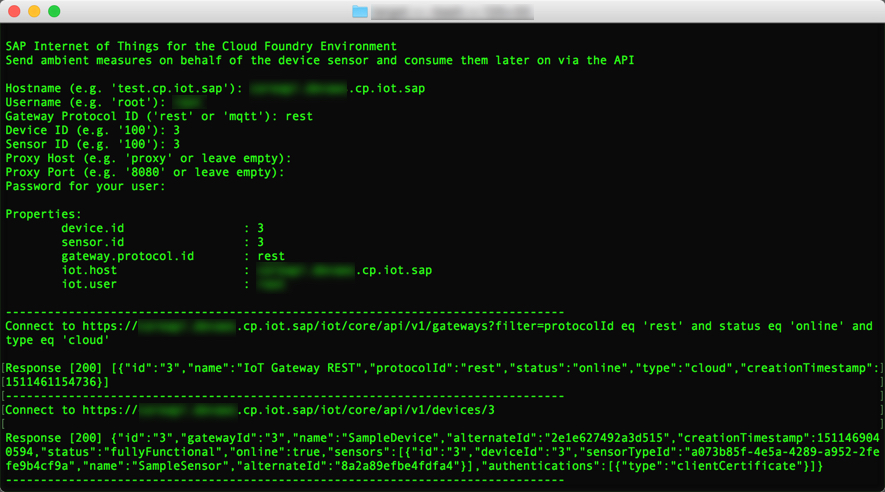
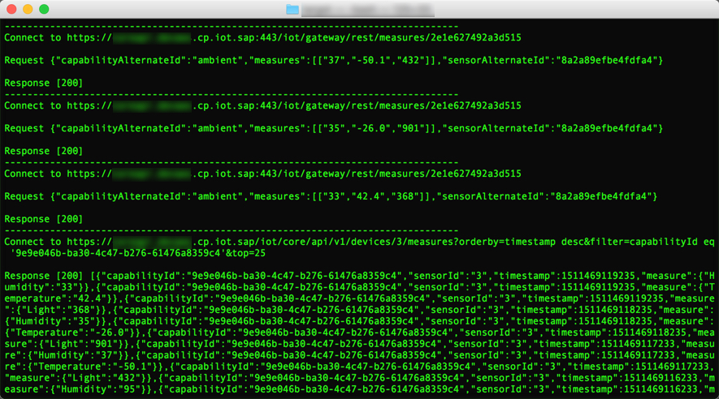

# SAP Internet of Things for the Cloud Foundry Environment
A sample Java application which is capable to send Humidity measures to the Gateway Cloud either via HTTP or MQTT protocol using the device PEM-Certificate based authentication and consume them later on via RESTful API. 

## Import project
This sample application is provided as Maven project and could be imported to IDE with the help of respective plug-in or Maven command line interface.

## Run application from the IDE
- Run [Main class](src/main/java/sample/Main.java) as Java application.

## Build with Maven
It is possible to build an executable JAR with Maven. Simply run `mvn clean install` from the command line.

>Note: After the very first import from GitHub, ensure to build the top-level [java-samples](../) reactor project.

### Run compiled version
- Find the compiled version under project's `target` directory
- Execute from the command line `java -jar send-measure.jar`

>Note: In order to save efforts when typing sample properties every time you launch an application, you may place the `sample.properties` file at the same level to your executable JAR. A template for such a file could be found under [resources](src/main/resources/sample.properties)




## Execution Steps
The following steps are being performed during execution:

1. Get online gateway (either REST or MQTT) based on the user input.
    ```
    Authorization: Basic <base64-encoded credentials>
    GET https://%iot.host%:443/iot/core/api/v1/gateways
    ```
2. Get online device by its identifier.
    ```
    Authorization: Basic <base64-encoded credentials>
    GET https://%iot.host%:443/iot/core/api/v1/devices/%device.id%
    ```
	1. Create a new device if it does not exist or no online device with the specified identifier was found in the gateway.
	    ```
	    Authorization: Basic <base64-encoded credentials>
	    POST https://%iot.host%:443/iot/core/api/v1/devices  
	    {
		    "gatewayId" : "%gateway.id%",
		    "name" : "%random.device.name%"
	    }
	    ```
3. Check if custom "Room_Humidity" capability exists.
    ```
    Authorization: Basic <base64-encoded credentials>
    GET https://%iot.host%:443/iot/core/api/v1/capabilities
    ```
	1. Create "Room_Humidity" capability if not found.
	    ```
	    Authorization: Basic <base64-encoded credentials>
	    POST https://%iot.host%:443/iot/core/api/v1/capabilities  
	    {
		    "name" : "Room_Humidity",
		    "properties" : [
			    {
				    "name" : "Humidity",
				    "dataType" : "integer",
				    "unitOfMeasure" : "%"
			    }
		    ]
	    }
	    ```
4. Check if custom "Humidity_Sensors" sensor type exists.
    ```
    Authorization: Basic <base64-encoded credentials>
    GET https://%iot.host%:443/iot/core/api/v1/sensorTypes
    ```
	1. Create "Humidity_Sensors" sensor type if not found.
	    ```
	    Authorization: Basic <base64-encoded credentials>
	    POST https://%iot.host%:443/iot/core/api/v1/sensorTypes  
	    {
		    "name" : "Humidity_Sensors",
		    "capabilities" : [
			    {
				    "id" : "%humidity.capability.id%",
				    "type" : "measure"
			    }
		    ]
	    }
	    ```
5. Get device sensor by its identifier which is assigned to the device.
    1. Create a new sensor and assign it to the device if no sensor is assigned to the device or a sensor has no reference to the "Room_Humidity" sensor type.
	    ```
	    Authorization: Basic <base64-encoded credentials>
	    POST https://%iot.host%:443/iot/core/api/v1/sensors  
	    {
		    "deviceId" : "%device.id%",
		    "sensorTypeId" : "%humidity.sensor.type.id%",
		    "name" : "%random.sensor.name%"
	    }
	    ```
	    >Note: A new sensor will be mapped to the custom "Humidity_Sensors" Sensor Type.
6. Get device PEM-certificate.
    ```
    Authorization: Basic <base64-encoded credentials>
    GET https://%iot.host%:443/iot/core/api/v1/devices/%device.id%/authentications/clientCertificate/pem
    ```
7. Create Java SSL context based on the PEM certificate.
8. Send random Humidity measures on behalf of the device sensor.
    ```
    Authorization: <device-certificate>
    REST: POST https://%iot.host%:443/iot/gateway/rest/measures/%device.alternate.id%
    MQTT: PUBLISH ssl://%iot.host%:8883 on topic 'measures/%device.alternate.id%'  

    {
	    "capabilityAlternateId" : "%humidity.capability.alternate.id%",
	    "measures" : [ "%random.humidity.percentage%" ],
	    "sensorAlternateId" : "%sensor.alternate.id%"
    }
    ```

    >Note: The sending rate is one measure per second. Duration is 5 seconds.

9. Consume the latest measures via the RESTful API.
    ```
    Authorization: Basic <base64-encoded credentials>
    GET https://%iot.host%:443/iot/core/api/v1/devices/%device.id%/measures?orderby=timestamp desc&filter=capabilityId eq '%humidity.capability.id%'&top=5
    ```

